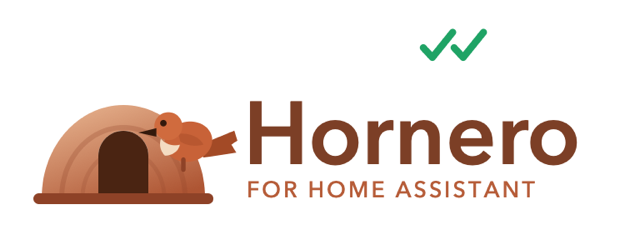

<p align="center">
  
</p>

<p align="center">
  <strong>WhatsApp messaging for Home Assistant.</strong><br>
  Pair your phone from a panel in the sidebar, then send and receive messages
  from any automation.
</p>

<p align="center">
  <a href="README.es.md">Español</a> ·
  <a href="hornero/DOCS.md">Service reference</a> ·
  <a href="MIGRATION.md">Upgrading</a>
</p>

---

The hornero is the bird that builds its house out of mud — a fitting name for
something that lives in your home and carries messages.

## What it does

- **Sends** text, images, audio, video, documents, locations and reactions to
  contacts and groups.
- **Receives** messages as Home Assistant events, with an allowlist so only the
  senders you choose can trigger automations.
- **Camera snapshots and clips** straight from any `camera` or `image` entity,
  including footage recorded _before_ the trigger fired.
- **Entities**, not just services: connection sensors, the pairing QR as an
  image, buttons and switches — usable in dashboards and conditions.
- **Several accounts** side by side, each paired separately.

## Requirements

- Home Assistant OS or Supervised. This is an add-on; Container and Core
  installations cannot run it.
- Architectures: `aarch64` and `amd64` — Home Assistant no longer builds
  32-bit targets.
- A phone with WhatsApp, to pair the account.

> **Hornero uses an unofficial interface to WhatsApp.** WhatsApp does not
> support this kind of client and accounts can be blocked for automated or
> unusual activity. Do not use it for bulk or unsolicited messaging. Read
> [LEGAL.md](LEGAL.md) before installing.

## Installation

1. **Add the repository.** In Home Assistant, go to **Settings → Add-ons →
   Add-on Store**, open the ⋮ menu, choose **Repositories**, and add:

   ```text
   https://github.com/pabloantonelli/hornero
   ```

2. **Install Hornero** from the store. The image is prebuilt, so it downloads
   rather than compiling on your machine.

3. **Start it**, with **Show in sidebar** enabled.

4. **Restart Home Assistant Core** (**Settings → System → Restart**). This is
   needed once so the Hornero integration is loaded.

5. **Confirm the integration.** Home Assistant offers to set up Hornero on its
   own. If it does not, add it from **Settings → Devices & services → Add
   integration → Hornero**; the dialog fills itself in.

6. **Pair your phone.** Open **Hornero** in the sidebar and either scan the QR
   code, or enter your number to get an 8-digit code and use **WhatsApp →
   Linked devices → Link with phone number**.

7. **Send a test message** from **Developer tools → Actions**:

   ```yaml
   action: hornero.send_message
   data:
     clientId: default
     to: "34600000000"
     body:
       text: Hello from Home Assistant
   ```

## Blueprints

Ready-made automations. Click to import:

| Blueprint                                                                                                                                                                                                                          | What it does                                                |
| ---------------------------------------------------------------------------------------------------------------------------------------------------------------------------------------------------------------------------------- | ----------------------------------------------------------- |
| [Send a message when something happens](https://my.home-assistant.io/redirect/blueprint_import/?blueprint_url=https%3A%2F%2Fgithub.com%2Fpabloantonelli%2Fhornero%2Fblob%2Fmain%2Fblueprints%2Fautomation%2Fhornero%2Fnotify.yaml) | An entity changes state, you get a message                  |
| [Camera snapshot or clip on motion](https://my.home-assistant.io/redirect/blueprint_import/?blueprint_url=https%3A%2F%2Fgithub.com%2Fpabloantonelli%2Fhornero%2Fblob%2Fmain%2Fblueprints%2Fautomation%2Fhornero%2Fcamera.yaml)     | Motion triggers a photo or a video clip                     |
| [Alert when the session drops](https://my.home-assistant.io/redirect/blueprint_import/?blueprint_url=https%3A%2F%2Fgithub.com%2Fpabloantonelli%2Fhornero%2Fblob%2Fmain%2Fblueprints%2Fautomation%2Fhornero%2Fsession-lost.yaml)    | Tells you through another channel when WhatsApp disconnects |

## Entities

Each paired client appears as a device:

| Entity                                | Use it for                                                    |
| ------------------------------------- | ------------------------------------------------------------- |
| `binary_sensor.<client>_connected`    | Conditions, and alerting on a dropped session                 |
| `sensor.<client>_status`              | Connected, reconnecting or disconnected                       |
| `image.<client>_qr`                   | The pairing code, on a dashboard                              |
| `button.<client>_restart` / `_logout` | Reconnect or unpair                                           |
| `notify.<client>`                     | Sends to the default recipient set in the integration options |
| `notify.<name>`                       | One per allowed sender, named after the contact or group      |

The add-on's behaviour is exposed too: `switch.hornero_typing_indicator`,
`switch.hornero_mark_read`, `switch.hornero_mark_online`,
`switch.hornero_groups_require_mention`, `number.hornero_typing_max_seconds`
and `select.hornero_log_level`.

### Keeping group noise out

With Hornero's number in a group, every message posted there would reach Home
Assistant. Turn on `switch.hornero_groups_require_mention` — or the matching
switch in the panel's Incoming tab — and a group message is only passed on when
it mentions Hornero or replies to a message Hornero sent. Direct chats are
never filtered this way.

### Notify entities

A notify entity is a single destination — Home Assistant gives it no recipient
field — so Hornero creates **one per allowed sender**, named after the contact
or group. They appear and disappear as you edit the Incoming list, and are
ready for any blueprint that expects a notifier.

There is also a `notify.<client>` entity that sends to a fixed recipient, set
in **Settings → Devices & services → Hornero → Configure**. For a recipient
that varies, or one not on the allowlist, use `hornero.send_message`.

## The Hornero panel

Seven tabs in the sidebar:

- **Status** — every client, with pairing by QR or 8-digit code.
- **Send** — send a message or a camera snapshot to check everything end to end.
- **Groups & contacts** — who may trigger your automations, next to your chats
  with profile pictures and search. Copy a group's ID straight into a service
  call; group IDs cannot be derived from a phone number, so this is how you get
  them.
- **Messages** — what was sent and received lately, with the delivery state of
  each outgoing message.
- **Snippet builder** — pick an action, fill in the fields, and copy the call
  as Home Assistant YAML, as an importable Node-RED node, or as `curl`.
- **Settings** — behaviour you can change without restarting.
- **Help** — services, events and addressing rules.

## Who can trigger your automations

Incoming messages arrive as `hornero_message` events, and automations act on
them. **While no sender is listed, anyone who writes to your number can trigger
them.** Open the **Groups & contacts** tab and allow the senders you accept —
your chats and recent senders are listed there with an **Allow** button, so you
never have to work out an identifier by hand.

- **An allowed person** gets through in a direct chat, and in allowed groups set
  to _Only allowed contacts_ — never in a group that is not on the list.
- **An allowed group** lets through _every member_ or _only allowed contacts_,
  chosen per group. The tab shows which allowed people are in each group.

That matters because WhatsApp increasingly identifies people by a **LID**
(`173478124720340@lid`) that does not reveal their phone number. Allowing a
number also covers that person's LID, and the other way round.

## Sending camera snapshots and clips

```yaml
action: hornero.send_media
data:
  clientId: default
  to: "34600000000"
  entity_id: camera.front_door
  caption: Someone is at the door
  duration: 10 # omit for a still image
  lookback: 5 # seconds recorded before the trigger
```

Recording needs a camera with the `stream` component; still-image cameras can
send snapshots only, and `lookback` needs the stream preloaded.

## Node-RED

No token and no HTTP node needed: Hornero registers ordinary Home Assistant
services and events, which Node-RED reaches over its websocket connection.

- **To send**: a _call service_ node, domain `hornero`, service `send_message`
  or `send_media`.
- **To receive**: an _events: all_ node listening for `hornero_message`,
  `hornero_message_ack` or `hornero_presence`.

Ready-made subflows are in
[`node-red/hornero-subflows.json`](node-red/hornero-subflows.json) — copy the
file contents, press `Ctrl+I` in Node-RED and paste. The Snippet builder tab
writes both forms out for any action.

## Configuration

```yaml
clients:
  - default # one entry per WhatsApp account
api_token: "" # generated automatically when empty
allowed_senders: [] # empty accepts everyone
log_level: info
mark_read: false # blue ticks on incoming messages
typing_indicator: true # "typing…" and a pause before sending
typing_max_seconds: 3
mark_online: false # careful: stops notifications on your phone
refresh_hours: 0
```

These seed the settings on a fresh install. After that the **Settings** tab and
the switch entities are the source of truth, so changing behaviour needs no
restart.

Both edit the same stored settings, so a change in one shows up in the other:
the panel refreshes while its tab is open, and the entities on their next poll,
within about fifteen seconds.

## Events

| Event                 | Fired when                               |
| --------------------- | ---------------------------------------- |
| `hornero_message`     | A message arrives from an allowed sender |
| `hornero_message_ack` | A message you sent was delivered or read |
| `hornero_presence`    | A subscribed contact changes presence    |

## HTTP API

Only needed to reach the add-on from outside Home Assistant. All `/api/v1`
routes take a bearer token — the `api_token` option, or the generated one in
`/config/custom_components/hornero/connection.json`:

```bash
curl -X POST http://<add-on>:3000/api/v1/clients/default/messages \
  -H "Authorization: Bearer <token>" \
  -H "Content-Type: application/json" \
  -d '{"to":"34600000000","body":{"text":"Hello"}}'
```

The full route list is in [DOCS.md](hornero/DOCS.md).

## Troubleshooting

**The QR never appears.** Open the panel — it renders the QR directly. If it
stays on _Waiting for a QR code_, check the add-on log and make sure the host
reaches `web.whatsapp.com`.

**The integration was not offered automatically.** Add it from **Settings →
Devices & services**; the dialog fills in from the file the add-on writes.

**Services are missing.** Restart Home Assistant Core once after installing.

**Messages arrive but nothing happens.** Check the **Groups & contacts** tab:
if the allowlist has entries, anyone outside it is ignored on purpose, and a
group set to _Only allowed contacts_ ignores members who are not allowed.

## Development

```bash
cd hornero
npm ci
npm test
```

The build is pinned by `package-lock.json` and runs on Node 20+, so it is
identical on any machine. Dependency updates arrive as Renovate pull requests.

## Credits

- **[WhiskeySockets/Baileys](https://github.com/WhiskeySockets/Baileys)** — the
  WhatsApp Web library Hornero is built on.
- **[Giuseppe Castaldo](https://github.com/giuseppecastaldo/ha-addons)** —
  author of the add-on Hornero originally forked from. See [NOTICE](NOTICE).
- The Home Assistant community.

## License

Apache License 2.0 — see [LICENSE](LICENSE) and [NOTICE](NOTICE).

Not affiliated with, endorsed by, or connected to WhatsApp LLC or Meta
Platforms, Inc.
